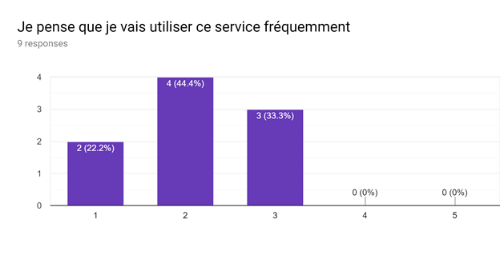

# ARPoC - Leanring By Doing
## Projet de Sofia et Xoeseko

Notre objectif était de montrer qu'il était possible d'utiliser la réalité augmentée pour pratiquer ou apprendre une activité physique.

#### Description:
La maquette est présentement une application Android à travers laquelle il est possible d'invoquer un modèle faisant du Tai-chi ou un modèéle faisant de la Boxe. Pour celà il faut tout d'abord que ARCore détecte un espace de jeu suffisamment grand. Une fois celà fait une pression sur l'écran permet de passer d'une expérience à une autre. Le modèle est toujours placé en ligne droite par rapport au point fixé par la caméra. Il reste ensuite à l'endroit ou il a été placé permettant de déplacer la caméra pendant l'expérience.

#### Étapes:
- [x] Utiliser du motion capture pour générer les animations que l'on souhaite apprendre (Tai-chi et Boxe pour le PoC)
- [x] Rigging d'un modèle 3D pour suivre les animations
- [x] Importer les animations dans unity afin de développer l'application
- [x] Protoype fonctionnel
- [x] Tests avec retours dans nos cercles proches
- [x] Préparation de la vidéo de démonstration et du rapport

#### Sondages:
Pour évaluer l'application nous avons simplement laissés libre champ à nos proches pour voir ce qu'ils pouvaient tirer de la version Android du PoC. Ils ont ensuite répondu à un SUS standard avec les résultats suivants :

#### Développement futurs:
Suite aux résultats il est évident qu'il faudrait travailler sur l'expérience utilisateur. Un point majeur qui pourrait grandement améliorer l'expérience utilisateur serait un casque de réalité augmentée comme les casques windows mixed reality. C'est pourquoi nous prévoyons de porter l'expérience sur ces plate-formes afin d'avoir une expérience plus concrête.

#### Sources:
We aim as much as possible to make use of open access software and assets.
 - The motion capture comes from the Carnegie Mellon university [motion capture library](http://mocap.cs.cmu.edu).
 - Royalty Free Music: All The Tea In China by Shane Ivers - https://www.silvermansound.com
 - Royalty Free Music: Action and Adventure by Shane Ivers - https://www.silvermansound.com

#### Outils:
- Unity
- Maya Autodesk
- MotionBuilder Autodesk
- Google ARCore
